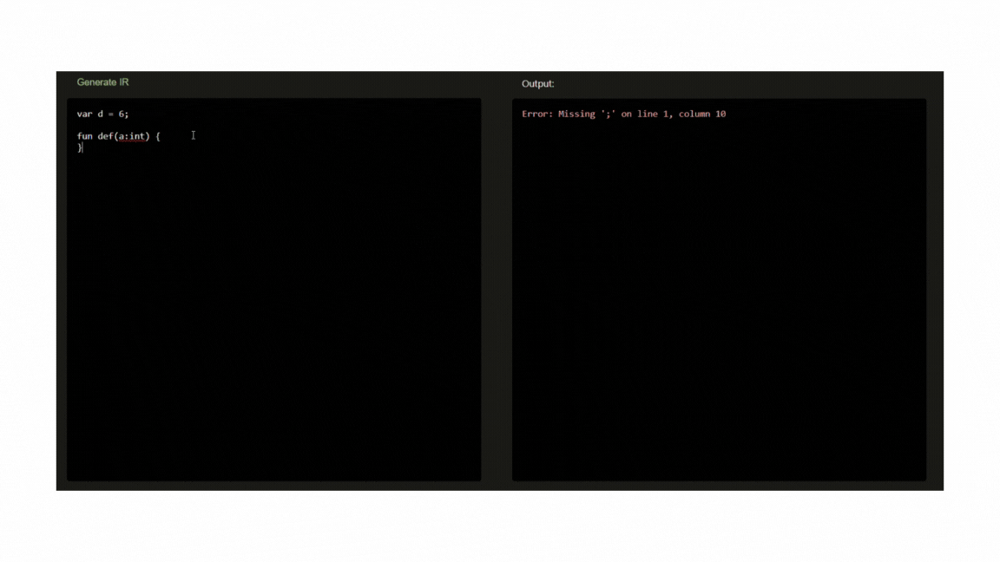

# Langtools

## About the project

This project is complementary to [Microparser](https://github.com/dashluu/Microparser/tree/master). It serves as a user
interface for the parser at the backend. This helps me debug the parser and can be considered as a simple code editor,
although that is not the intention. In summary, this is just another hobby project to test how well the parser works.

## Architecture

### Frontend and backend

The frontend and backend are separated, so they do not have knowledge of one another. This might cause some problems
such as the server not knowing if a domain is to be trusted. Hence, I enabled Cross-Origin Resource Sharing(CORS) by
listing the port where React is deployed, which is usually port 3000 on the local host. In the future, I might look
deeper into this problem, but for now, it is there for demo purposes.

* **Frontend**:
    * React framework.
    * Single-page application.
    * Modular components:
        * **Editor**: a component for editing the source code.
        * **OutputView**: a component for viewing the output after the code is parsed.
        * **Parser**: includes `Editor` and `OutputView` as a single modular component.
* **Backend**:
    * Spring Boot framework.
    * Uses the MVC design pattern.
    * Receives a string representing the user code and parses it using
      [Microparser](https://github.com/dashluu/Microparser/tree/master).
    * Sends the result as a text string if there is a syntax error or a JSON object associated with an Abstract Syntax
      Tree(AST) if the code is parsed successfully.

## Demo

